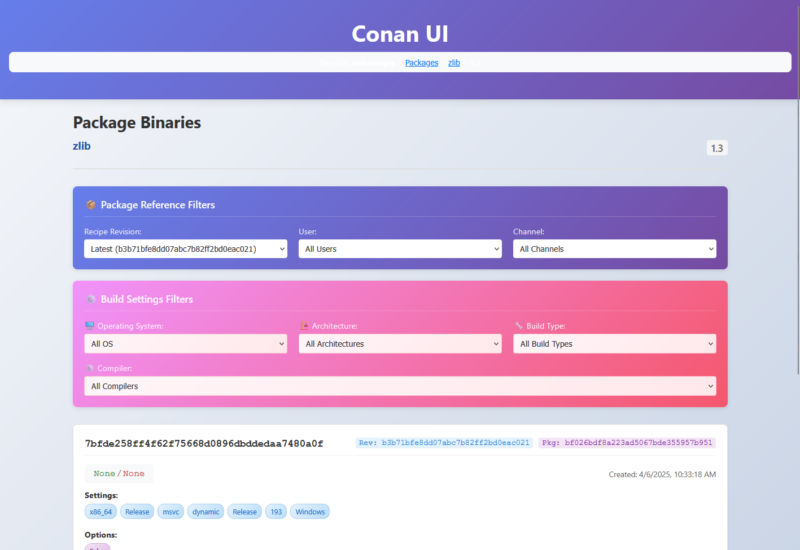

# 🔍 Conan UI

A modern web interface for browsing and searching your Conan packages. Get a clear overview of your remote repositories with an intuitive, responsive design.



## 🚀 Getting Started

### Prerequisites
- Python 3.8+ and pip
- Node.js 16+ and npm

### Quick Setup

1. **Clone the repository**:
   ```bash
   git clone https://github.com/roknus/conan-ui.git
   cd conan-ui
   ```

2. **Configure environment** (create `.env` file in backend directory):
   ```bash
   cd backend
   # Create .env file with your Conan remote settings
   ```
   
   Example `.env` content:
   ```env
   CUSTOM_REMOTE_NAME=myremote
   CUSTOM_REMOTE_URL=https://your-conan-server.com/artifactory/api/conan/conan
   CUSTOM_REMOTE_USER=username
   CUSTOM_REMOTE_PASSWORD=password
   ```

3. **Start the backend**:
   ```bash
   pip install -r requirements.txt
   python main.py
   ```

4. **Start the frontend** (in a new terminal):
   ```bash
   cd frontend
   npm install
   npm start
   ```

5. **Open your browser** to `http://localhost:3000`

### 🐳 Docker

For a one-command setup:

1. **Configure environment** (create `.env` file in root directory):
   ```env
   CUSTOM_REMOTE_NAME=myremote
   CUSTOM_REMOTE_URL=https://your-conan-server.com/artifactory/api/conan/conan
   CUSTOM_REMOTE_USER=username
   CUSTOM_REMOTE_PASSWORD=password
   ```

2. **Start with Docker Compose**:
   ```bash
   docker-compose up -d
   ```

3. **Open your browser** to `http://localhost:3000`

## 🤝 Contributing

Contributions welcome! Please feel free to submit pull requests or create issues for bugs and feature requests.

## 📝 License

GPL 3.0 License - see [LICENSE](LICENSE) file for details.
