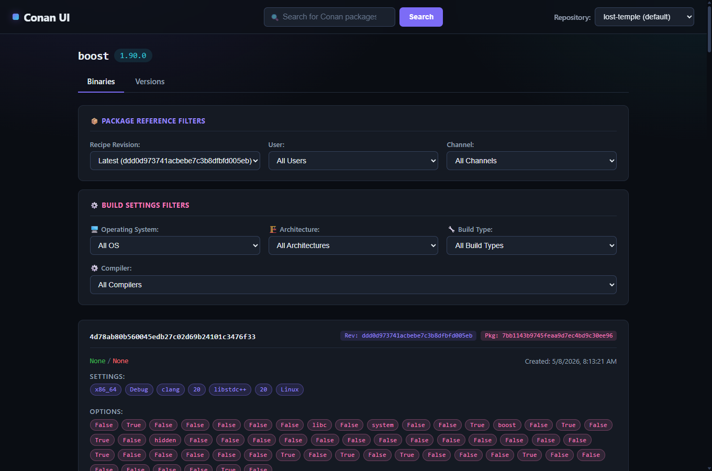

# Conan UI

A modern web interface for browsing and deleting your Conan packages on remote repositories, built for JFrog Artifactory. Get a clear overview of your remotes with an intuitive, responsive design.



## Getting Started

### Prerequisites
- Python 3.8+ and [Poetry](https://python-poetry.org/)
- Node.js 16+ and npm

### Quick Setup

1. **Clone the repository**:
   ```bash
   git clone https://github.com/roknus/conan-ui.git
   cd conan-ui
   ```

2. **Configure repositories** (create a `.env` file):
   ```bash
   # Copy the example environment file
   cp .env.example .env
   # Edit .env with your Artifactory host, repositories, and credentials
   ```

   Example `.env`:
   ```bash
   ARTIFACTORY_URL=https://your-artifactory.com
   CONAN_REMOTES=conan-repo,conan-dev
   CONAN_LOGIN_USERNAME=username
   CONAN_PASSWORD=password
   ```

   Each remote's URL is derived as
   `${ARTIFACTORY_URL}/artifactory/api/conan/<name>`, so `conan-repo` above
   becomes `https://your-artifactory.com/artifactory/api/conan/conan-repo`.
   The **first** name in `CONAN_REMOTES` is the default remote.

   > `.env` is gitignored — never commit credentials.

3. **Start the backend** (dependencies are managed with [Poetry](https://python-poetry.org/)):
   ```bash
   cd backend
   poetry install
   poetry run python main.py   # serves on http://localhost:8000
   ```

4. **Start the frontend** (in a new terminal):
   ```bash
   cd frontend
   npm install
   npm start
   ```

5. **Open your browser** to `http://localhost:3000`

### Docker

For a one-command setup:

1. **Configure repositories** (create a `.env` file in the root directory):
   ```bash
   # Copy the example environment file
   cp .env.example .env
   # Edit .env with your Artifactory host, repositories, and credentials
   ```

   ```bash
   ARTIFACTORY_URL=https://your-artifactory.com
   CONAN_REMOTES=conan-repo,conan-dev
   CONAN_LOGIN_USERNAME=username
   CONAN_PASSWORD=password
   ```

   > Docker Compose reads `.env` automatically and passes these into the
   > container — no file is mounted.

2. **Start with Docker Compose**:
   ```bash
   docker-compose up -d
   ```

3. **Open your browser** to `http://localhost:3000`

## Contributing

Contributions welcome! Please feel free to submit pull requests or create issues for bugs and feature requests.

## License

GPL 3.0 License - see [LICENSE](LICENSE) file for details.
